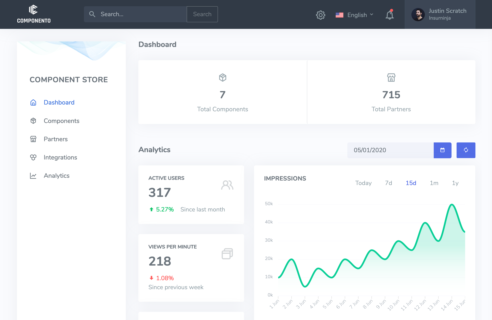

# Component Store

## About

Store to publish and distribute Componento components.

## Prerequisites

You need:

* Node >= Version 12
* Postgres >= Version 12

You can either setup a local database or start a docker container

    docker run --name componento-db -e POSTGRES_USER=componento -e POSTGRES_PASSWORD=secret -e POSTGRES_DB=componento -p 5432:5432 -d postgres

## Build and run

After cloning the repository, you can install dependencies:

    npm install
    
Run database migrations to initialize/update db schema:

    npm run migrate   
    
Compile typescript to javascript:

    npm run build
    
Run tests:

    npm run test    
    
Start the server (compiles implicitly):

    npm start
    
Start the server in watch mode during development:

    npm run watch

## Test API

You can upload a sample component using `curl`:

    curl -X POST -F "foo=@./spec/sample_component.tar" http://localhost:3000/upload

## Database migrations

To create, test, and run database migrations you should install db-migrate as globally:

    npm install -g db-migrate [db-migrate-pg]
    
Afterwards you can use `db-migrate` from command line:

    # Reset database
    db-migrate reset 
    
    # Upgrade database
    db-migrate up
    
    # Create a new migration script
    db-migrate create add-something-to-my-db
    
The migrations scripts can be found in directory `migrations`.
 
You can find the complete documentation of db-migrate here: https://db-migrate.readthedocs.io/en/latest/